# CI/CD Demo Project with GitHub Actions

## 1. Concepts

**CI vs CD**
- **CI (Continuous Integration):** every push or pull request is automatically built, tested and scanned. Here: the `test`, `sast`, `sca` and `docker-build` jobs.
- **CD (Continuous Delivery/Deployment):** a validated build is automatically scanned, published and deployed. Here: the `image-scan`, `push` and `deploy` jobs.

**CI/CD pipeline:** the chain of automated stages from commit to deployment:
`Tests + SAST + SCA → Docker Build → Trivy Image Scan → Push to Docker Hub → Deploy to Kubernetes`

**GitHub Actions:** GitHub's built-in automation platform. It runs workflows in response to repository events.

**Workflow:** the YAML file `.github/workflows/ci.yml`, which defines the whole pipeline. It runs on `push` and `pull_request` to `main`.

**Jobs:** independent groups of steps. Jobs run in parallel unless ordered with `needs:`. This workflow has seven: `test`, `sast`, `sca`, `docker-build`, `image-scan`, `push` and `deploy`.

**Steps:** the individual tasks inside a job. A step either uses a prebuilt action (`uses:`) or runs a shell command (`run:`).

**Runners:** the machines that execute jobs. All jobs use `runs-on: ubuntu-latest`, a fresh GitHub-hosted Linux VM.

**Secrets:** encrypted values stored in repository settings, referenced as `${{ secrets.DOCKERHUB_TOKEN }}` for the Docker Hub login, so credentials never appear in the code.

**Artifacts:** files saved from a workflow run (such as reports) using `actions/upload-artifact`. *(Not yet added to this workflow, see note in section 4.)*

**Build:** `docker build` turns the source code into a container image.

**Test:** `pytest --cov=app --cov-report=term-missing` runs the unit tests with coverage.

**Pipeline execution:** a push to `main` triggers the workflow, jobs run in dependency order, and `deploy` runs only on pushes to `main` (`if: github.ref == 'refs/heads/main' && github.event_name == 'push'`).

---

## 2. Application Source Code, Dockerfile and Workflow

### `ls -la` and `git ls-files`
Lists the project folder and the files tracked by Git: the application source (`app/`), tests, Dockerfile, Kubernetes manifests and the workflow.

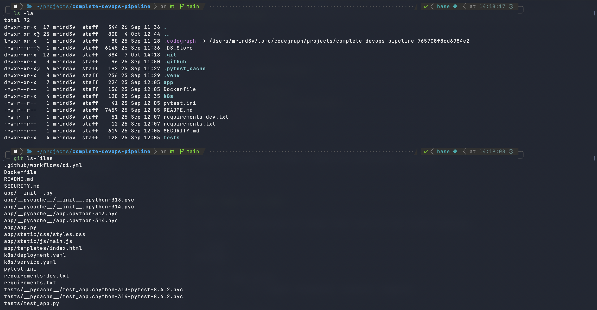

### `cat Dockerfile` and `cat .github/workflows/ci.yml` (start)
The Dockerfile builds on `python:3.12-slim`, installs the dependencies, copies the app, exposes port 5001 and starts it. The workflow file begins with its triggers and the first job, `test`.

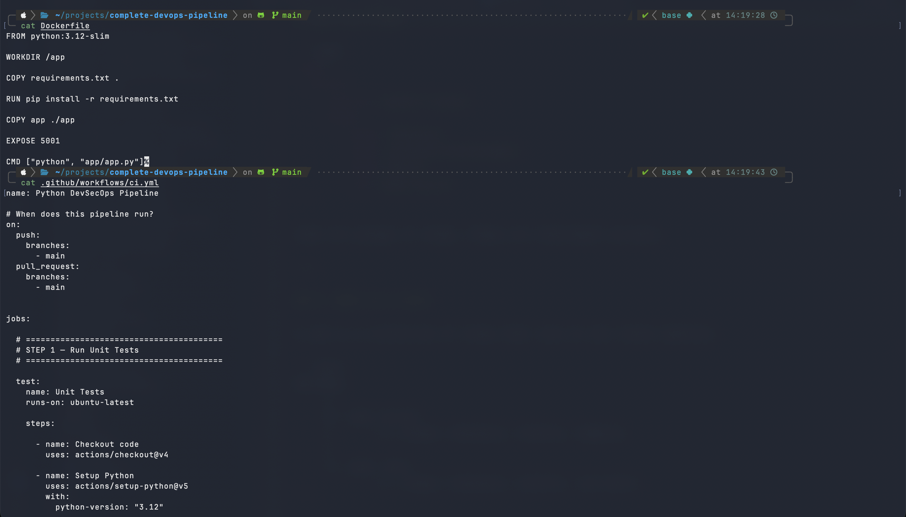

### `cat .github/workflows/ci.yml` (continued): test, SAST and SCA jobs
The `test` job installs dependencies and runs pytest. The `sast` job runs CodeQL, and the `sca` job begins.

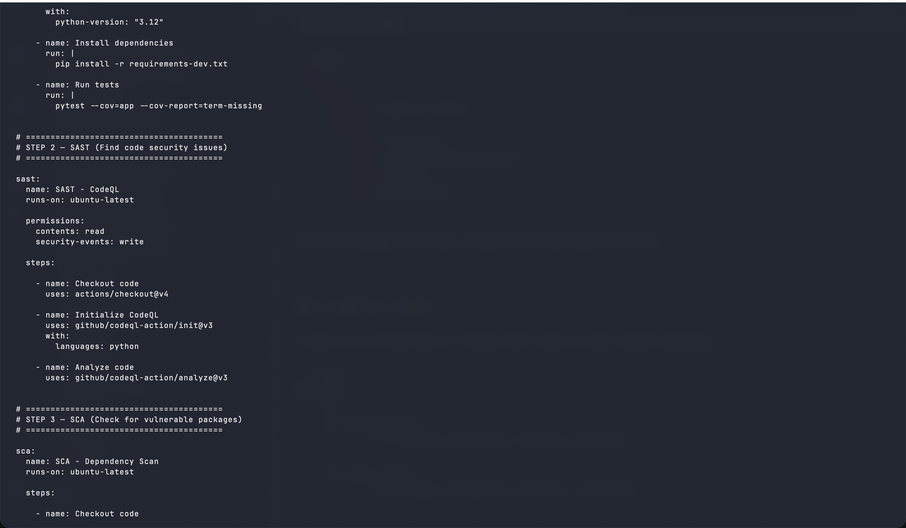

### `cat .github/workflows/ci.yml` (continued): SCA and Docker build jobs
`sca` scans dependencies with `pip-audit`. `docker-build` uses `needs: [test, sast, sca]`, so it runs only after all three pass.

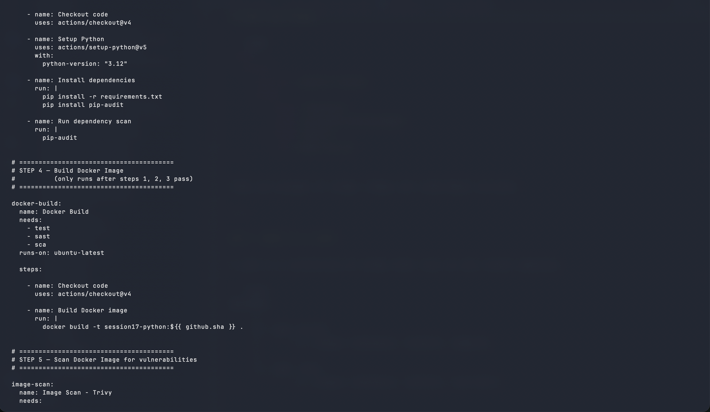

### `cat .github/workflows/ci.yml` (continued): image scan and push jobs
`image-scan` scans the image with Trivy for HIGH and CRITICAL vulnerabilities. `push` logs in to Docker Hub using the `DOCKERHUB_TOKEN` secret.

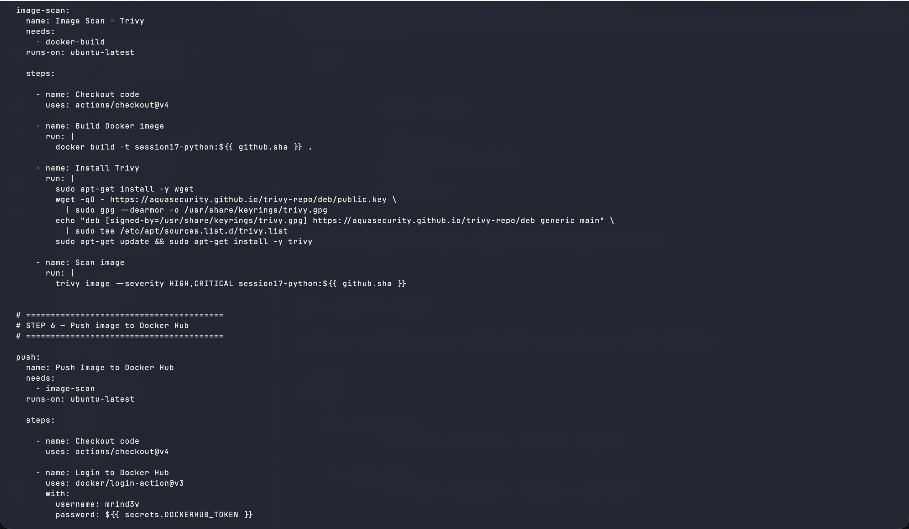

### `cat .github/workflows/ci.yml` (continued): push and deploy jobs
The image is pushed with the commit SHA and `latest` tags. The `deploy` job (CD) creates a `kind` cluster, injects the image tag and applies the Kubernetes manifests.

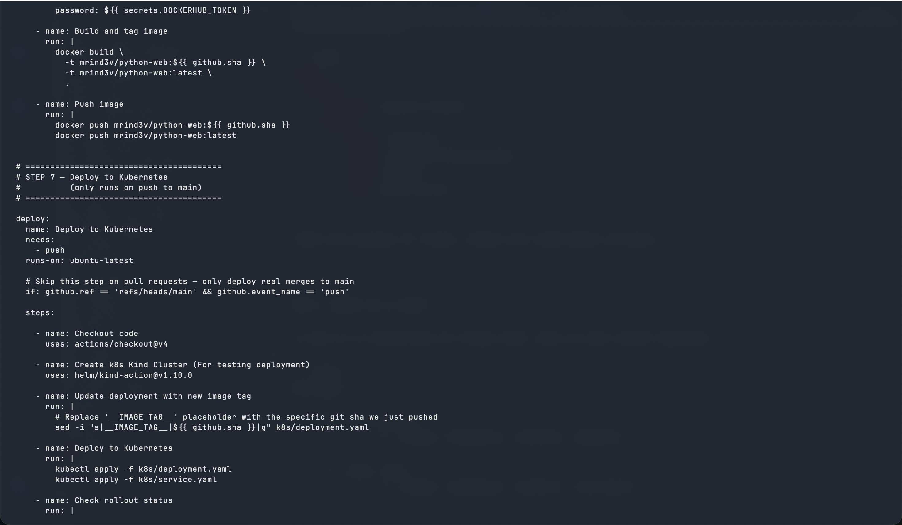

### `cat .github/workflows/ci.yml` (end): rollout check and smoke test
Waits for the rollout to finish, then port-forwards the service and uses `curl` to confirm the website and API respond.

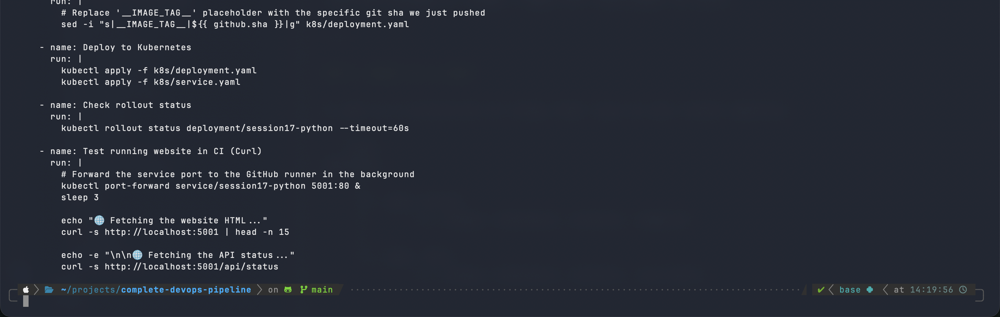

---

## 3. Build and Test (locally)

### `python3 -m venv venv && source venv/bin/activate` and `pip install -r requirements-dev.txt`
Creates an isolated Python environment and installs Flask, pytest and pytest-cov. This is the same as the workflow's "Install dependencies" step.

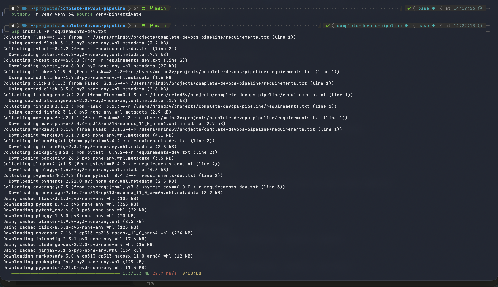

### `pytest --cov=app --cov-report=term-missing` and `docker build -t session17-python:local .`
**Test:** all 8 unit tests pass, with a coverage report. **Build:** Docker builds the image from the Dockerfile, step by step.

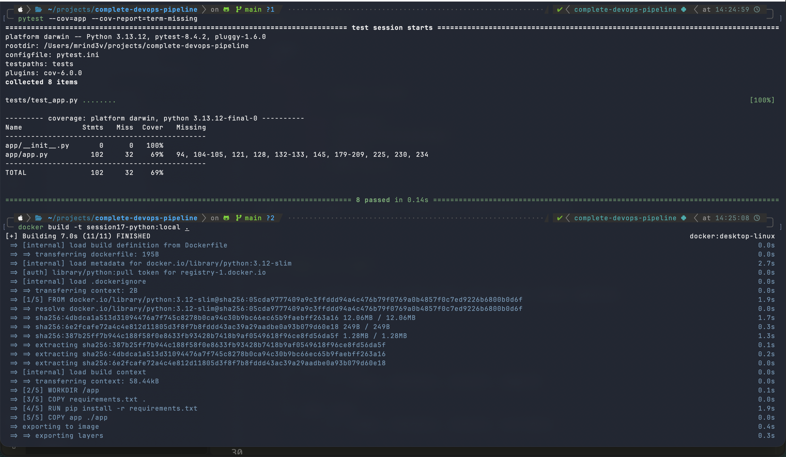

### `docker images | grep session17`, `docker run -d -p 5001:5001 --name demo session17-python:local`, `curl http://localhost:5001/api/status`, `docker rm -f demo`
Confirms the image exists, runs it as a container, checks the API returns `"status": "running"`, then removes the container.

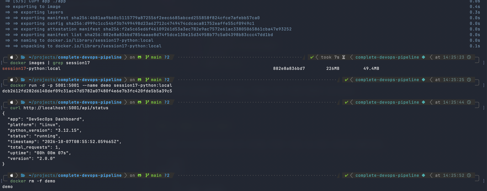

---

## 4. Pipeline Execution

### `git status`, `git add . && git commit -m "..."`, `git push origin main`
Commits the changes and pushes them to `main`. The push is the event that triggers the workflow.

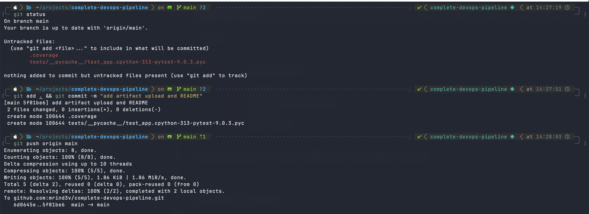

### `gh run list`
Lists the workflow runs. The newest is in progress. The previous run succeeded, and the earliest failed before the workflow file was fixed.

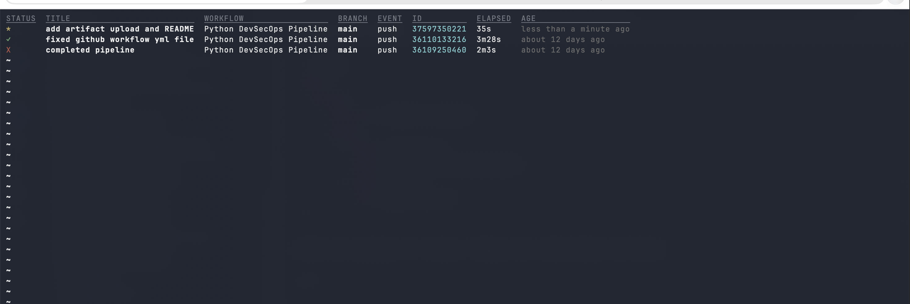

### `gh run watch`
Streams the live progress of the run, showing job and step status. The annotations are deprecation warnings, not failures.

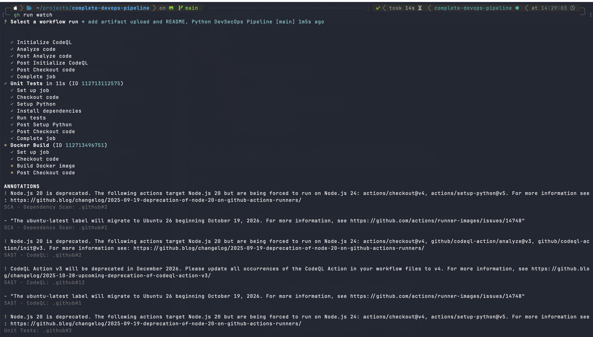

### GitHub Actions: pipeline in progress
The job graph shows Unit Tests, SAST and SCA running in parallel, then Docker Build, Image Scan, Push and Deploy in sequence.

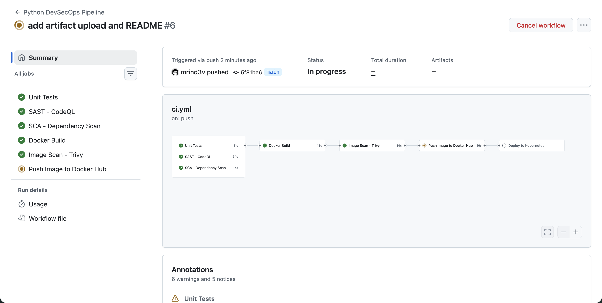

### GitHub Actions: pipeline completed successfully ✅
All seven jobs passed and the run status is **Success**, including the Kubernetes deployment.

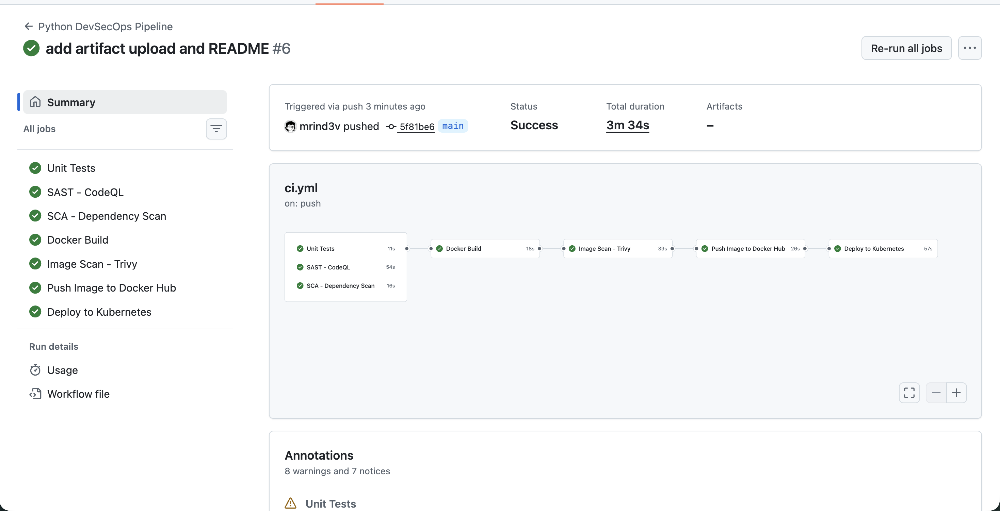

> **Note on artifacts:** the Artifacts field above shows `–` because this workflow does not yet upload an artifact. One can be added to the `test` job with `actions/upload-artifact@v4` after running pytest with `--cov-report=xml`.
